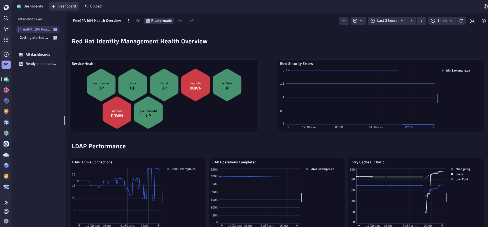
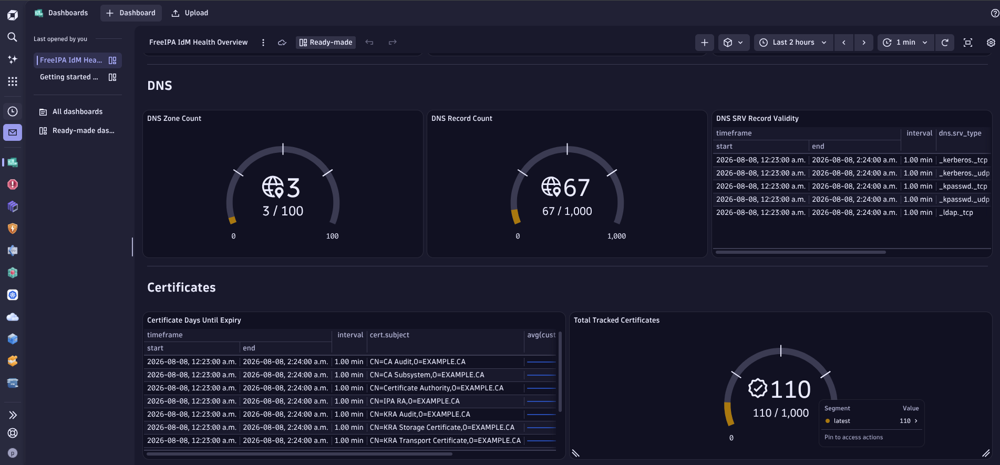

# FreeIPA IdM Health Monitor — Dynatrace Extension 2.0

A Dynatrace Extensions Framework 2.0 (EF2) Python extension for monitoring FreeIPA / Red Hat Identity Management servers remotely via ActiveGate.

## What It Monitors

| Feature | Metrics | Source |
|---|---|---|
| **Service Health** | Status of 7 FreeIPA services (LDAP, KDC, kadmin, httpd, CA, DNS, certmonger) | Protocol-level probes ([design rationale](documentation/SERVICE_HEALTH_DESIGN.md)) |
| **LDAP Performance** | Connections, operations, threads, bytes sent, bind errors, cache hit ratios | `cn=monitor` via LDAP |
| **Replication** | Agreement status, lag, conflict entries, changes sent | `cn=mapping tree,cn=config` via LDAP |
| **DNS** | Zone count, record counts, SRV record validation | `cn=dns` via LDAP |
| **Certificates** | Days until expiry, tracking status, total tracked count | IPA API |

The extension includes a pre-built overview dashboard and custom topology entities (FreeIPA Server, Replication Agreement) in Dynatrace.

### Dashboard Preview

Service Health honeycomb with real-time UP/DOWN detection, Bind Security Errors, and LDAP Performance metrics:



DNS gauges, SRV record validation, certificate expiry tracking, and total tracked certificates:



---

## Prerequisites

| Requirement | Details |
|---|---|
| Dynatrace SaaS or Managed tenant | Gen3 tenant required for Document dashboards |
| Dynatrace ActiveGate | Environment ActiveGate with Extensions Execution Controller (EEC) |
| FreeIPA / Red Hat IdM server | RHEL 7+ or Fedora with FreeIPA installed |
| VS Code | With the **Dynatrace Extensions** extension installed (`DynatracePlatformExtensions.dynatrace-extensions`) |
| Python 3.10+ | On the development/build machine |
| Network access | ActiveGate must reach the IdM server on ports 636 (LDAPS) and 443 (HTTPS) |

---

## Deployment Guide

This guide walks through every step from a fresh clone to a working dashboard in Dynatrace. Replace all placeholder values (`example.com`, `idm1.example.com`, etc.) with your actual environment values.

### Step 1: Clone the Repository

```bash
git clone <repo-url>
cd freeipa_idm_health
```

### Step 2: Set Up the FreeIPA Monitoring Account

You need a dedicated IdM user with read-only access. **Do not reuse an admin account.**

#### Option A: Automated (Ansible Playbook)

The included playbook creates the user permissions and LDAP ACIs. It prompts for all environment-specific values and passwords at runtime.

```bash
ansible-playbook setup_idm_monitoring_role.yml
```

The playbook will prompt for:
- **IdM server FQDN** — e.g. `idm1.example.com`
- **LDAP base DN** — e.g. `dc=example,dc=com`
- **IPA admin password** — your `admin` account password
- **Directory Manager password** — the 389 DS Directory Manager password

> **Note:** The Ansible playbook requires the `redhat.rhel_idm` and `community.general` collections. Install with:
> ```bash
> ansible-galaxy collection install redhat.rhel_idm community.general
> ```

#### Option B: Manual

If you prefer to configure manually, see [SECURITY_GUIDE.md](documentation/SECURITY_GUIDE.md) for step-by-step IPA CLI and LDAP commands.

#### Create the Monitoring User (if not already created)

```bash
ipa user-add ldap-lookup \
  --first="LDAP" \
  --last="Lookup" \
  --shell=/sbin/nologin \
  --password
```

Set a strong password (minimum 20 characters). You will need this password for the Dynatrace monitoring configuration.

After first login (required to clear the password reset flag):

```bash
kinit ldap-lookup
# Enter the password, then set it again when prompted
```

### Step 3: Deploy the IPA CA Certificate to the ActiveGate Host

The extension connects to your IdM server over LDAPS and needs to verify the TLS certificate.

```bash
# On the ActiveGate host:
scp root@idm1.example.com:/etc/ipa/ca.crt /etc/ipa/ca.crt

# Or fetch via HTTP (the CA cert is public):
curl -k -o /etc/ipa/ca.crt https://idm1.example.com/ipa/config/ca.crt
```

Verify the certificate:

```bash
openssl x509 -in /etc/ipa/ca.crt -noout -subject -issuer -dates
```

Set permissions:

```bash
chmod 644 /etc/ipa/ca.crt
```

> **Note the path.** You will enter this path (`/etc/ipa/ca.crt`) in the Dynatrace monitoring configuration later.

### Step 4: Install and Configure Dynatrace ActiveGate

If you don't already have an ActiveGate:

1. In your Dynatrace tenant, go to **Deploy Dynatrace** > **Install ActiveGate**
2. Select **Linux** and follow the installation instructions
3. Choose **Environment ActiveGate** when prompted

After installation, configure the ActiveGate group (optional but recommended for targeting):

```bash
sudo bash -c 'echo "group = IdM_Metrics" >> /var/lib/dynatrace/gateway/config/custom.properties'
sudo systemctl restart dynatracegateway
```

### Step 5: Create Dynatrace API Token

The Dynatrace Extensions VS Code extension needs an API token to upload and manage extensions.

1. In your Dynatrace tenant, go to **Access tokens** (search in the navigation bar)
2. Click **Generate new token**
3. Name it something like `Extension Development`
4. Select these **scopes**:
   - `extensions.read`
   - `extensions.write`
   - `extensionConfigurations.read`
   - `extensionConfigurations.write`
   - `extensionEnvironment.read`
   - `extensionEnvironment.write`
5. Click **Generate token**
6. **Copy the token immediately** — it won't be shown again

### Step 6: Configure VS Code for Extension Development

1. Install the **Dynatrace Extensions** extension in VS Code:
   - Search for `DynatracePlatformExtensions.dynatrace-extensions` in the Extensions marketplace
2. Open the `freeipa_idm_health` folder in VS Code
3. When prompted, or via the Command Palette (`F1`), configure the Dynatrace environment:
   - **Dynatrace URL**: `https://<your-tenant-id>.apps.dynatrace.com`
   - **API Token**: paste the token from Step 5

### Step 7: Generate Extension Signing Certificates

Extensions must be cryptographically signed. Each environment needs its own certificates.

1. Open the VS Code Command Palette (`F1`)
2. Run: **Dynatrace extensions: Generate certificates**
   - This creates a CA certificate and developer certificate in VS Code's storage

### Step 8: Distribute the CA Certificate

The CA certificate must be installed in two places:

#### 8a. Upload to Dynatrace Credential Vault

1. Open the VS Code Command Palette (`F1`)
2. Run: **Dynatrace extensions: Distribute certificate**
   - This uploads the CA cert to your tenant's Credential Vault automatically

#### 8b. Copy to the ActiveGate

The VS Code extension may not have permissions to write to the ActiveGate's certificate directory. Copy it manually:

```bash
# Find the generated CA cert (path varies by VS Code installation):
find ~/.vscode-server -name "ca.pem" -path "*/dynatrace-extensions/certificates/*" 2>/dev/null
# OR for desktop VS Code:
find ~/.vscode -name "ca.pem" -path "*/dynatrace-extensions/certificates/*" 2>/dev/null

# Copy to ActiveGate cert directory:
sudo cp <path-from-above>/ca.pem \
  /var/lib/dynatrace/remotepluginmodule/agent/conf/certificates/ca.pem

# Set ownership and permissions:
sudo chown dtuserag:dtuserag /var/lib/dynatrace/remotepluginmodule/agent/conf/certificates/ca.pem
sudo chmod 600 /var/lib/dynatrace/remotepluginmodule/agent/conf/certificates/ca.pem

# Restart the ActiveGate to pick up the new certificate:
sudo systemctl restart dynatracegateway
```

### Step 9: Build the Extension

1. Open the VS Code Command Palette (`F1`)
2. Run: **Dynatrace extensions: Build**
   - This packages the Python code, signs it, and creates a `.zip` in the `dist/` directory
   - The version in `extension.yaml` is automatically incremented on each build

> **Important:** Do not manually edit `extension.yaml` while the Dynatrace Extensions VS Code extension is active. It auto-increments the version on every file save, which can rapidly inflate version numbers.

### Step 10: Upload the Extension

1. Open the VS Code Command Palette (`F1`)
2. Run: **Dynatrace extensions: Upload**
   - This uploads the signed extension package to your Dynatrace tenant

### Step 11: Activate the Extension

1. Open the VS Code Command Palette (`F1`)
2. Run: **Dynatrace extensions: Activate**
   - This makes the extension version active on the tenant

### Step 12: Create the Monitoring Configuration

1. In your Dynatrace tenant, navigate to:
   ```
   https://<your-tenant-id>.apps.dynatrace.com/ui/apps/dynatrace.extensions.manager/configurations/
   ```
2. Find **FreeIPA IdM Health Monitor** and click **Add monitoring configuration**
3. Fill in the configuration fields:

| Field | What to Enter | Example |
|---|---|---|
| **FreeIPA Server FQDN** | Your IdM server's fully qualified domain name | `idm1.example.com` |
| **LDAP Port** | 636 for LDAPS (default) | `636` |
| **Use LDAPS** | Leave checked (default) | `true` |
| **LDAP Bind DN** | The monitoring user's full DN | `uid=ldap-lookup,cn=users,cn=accounts,dc=example,dc=com` |
| **LDAP Bind Password** | The monitoring user's password | *(enter your password)* |
| **LDAP Base DN** | Your domain's base DN | `dc=example,dc=com` |
| **CA Certificate Path** | Path to the IPA CA cert on the ActiveGate host | `/etc/ipa/ca.crt` |
| **IPA API Password** | Same password as LDAP bind (enables service and cert monitoring) | *(enter your password)* |
| **Polling Interval** | How often to collect metrics (seconds) | `300` |

4. Under **ActiveGate group**, select the group your ActiveGate belongs to (e.g., `IdM_Metrics`), or leave as default
5. Click **Save**

### Step 13: Verify Data Collection

After saving the configuration, wait 5-10 minutes for the first data collection cycle.

1. **Check extension status**: Go to the extension's configuration page and verify the status shows **OK**
2. **Check metrics**: Navigate to **Explore data** and search for `custom.freeipa.idm` — you should see metrics appearing
3. **Check the dashboard**: The overview dashboard is deployed automatically with the extension. Search for **FreeIPA IdM Health Overview** in **Dashboards**

#### Expected Metrics

On a single-server IdM deployment, you should see approximately 51 metrics per collection cycle:

- 7 service status metrics (one per service)
- ~30 LDAP performance metrics (monitor + SNMP + backend caches)
- 0 replication metrics (single server has no replication agreements)
- 3+ DNS metrics (zone count + records per zone + SRV validity)
- 8+ certificate metrics (total tracked + per-cert status and expiry)

### Step 14: Upgrade Existing Configurations (Subsequent Deployments)

When you build and upload a new version:

1. Upload the new version (Step 10)
2. Activate it (Step 11)
3. Go to the **Configurations** page:
   ```
   https://<your-tenant-id>.apps.dynatrace.com/ui/apps/dynatrace.extensions.manager/configurations/
   ```
4. Click **Upgrade all versions** and confirm
5. Verify the configuration status returns to **OK**

> **Tip:** Dynatrace has a maximum number of extension versions that can be stored. Periodically delete old versions from the Extensions page to avoid hitting this limit.

---

## Configuration Reference

See the full list of all configuration parameters in the [activationSchema.json](extension/activationSchema.json) file. Each field includes a description and validation constraints.

For detailed information about the monitoring account permissions, Kerberos keytab setup, network requirements, and credential management, see [SECURITY_GUIDE.md](documentation/SECURITY_GUIDE.md).

---

## Metrics Reference

See [METRICS_REFERENCE.md](documentation/METRICS_REFERENCE.md) for a complete list of all 39 metric keys, their dimensions, meanings, and data sources.

---

## Authentication Modes

The extension uses two separate authentication channels. LDAP queries always use simple bind (DN + password). The IPA API can authenticate via either password or Kerberos keytab. These can be combined.

### Configuration Combinations

| Configuration | LDAP Metrics | Services & Certs | When to Use |
|---|---|---|---|
| **LDAP credentials only** | Yes | No | LDAP performance monitoring only; no IPA API access |
| **LDAP credentials + IPA API password** | Yes | Yes | **Recommended.** Full monitoring, simplest setup |
| **LDAP credentials + Kerberos keytab** | Yes | Yes | **Recommended for Kerberos environments.** Full monitoring, IPA API via keytab |
| **Kerberos keytab only** | No | Yes | Passwordless, but only services and certificates are collected |

### What each channel provides

| Data | Source | Requires |
|---|---|---|
| LDAP performance (connections, ops, threads, cache) | `cn=monitor` via LDAP | LDAP credentials |
| Replication status, lag, conflicts | `cn=mapping tree,cn=config` via LDAP | LDAP credentials |
| DNS zones, records, SRV validation | `cn=dns` via LDAP | LDAP credentials |
| Service health (7 services) | IPA JSON-RPC API (`server_find`) | IPA API password **or** Kerberos keytab |
| Certificate expiry and tracking | IPA JSON-RPC API (`cert_find`) | IPA API password **or** Kerberos keytab |

### Recommended configuration

For the **complete metric set**, provide both LDAP credentials and either an IPA API password or Kerberos keytab:

- **LDAP Bind DN** — `uid=ldap-lookup,cn=users,cn=accounts,dc=example,dc=com`
- **LDAP Bind Password** — the monitoring user's password
- **IPA API Password** — same password as the LDAP bind (or enable Kerberos with a keytab)

When both LDAP credentials and Kerberos are configured, the extension uses LDAP simple bind for all LDAP queries and Kerberos (via `kinit` + `curl --negotiate`) for the IPA API.

### Kerberos prerequisites

When using Kerberos for IPA API authentication, the following packages must be installed on the ActiveGate host:

```bash
dnf install krb5-workstation curl
```

Verify curl has GSSAPI/SPNEGO support:

```bash
curl --version | grep -i GSS
```

See [SECURITY_KERBEROS_DESIGN.md](documentation/SECURITY_KERBEROS_DESIGN.md) for the full security rationale behind the Kerberos implementation.

---

## Troubleshooting

### Extension status shows error

Check the ActiveGate extension logs:

```bash
sudo journalctl -u dynatracegateway -f
# Or check the extension-specific logs:
ls /var/lib/dynatrace/remotepluginmodule/log/extensions/
```

### No data appearing

1. Verify network connectivity from the ActiveGate to the IdM server:
   ```bash
   openssl s_client -connect idm1.example.com:636 -CAfile /etc/ipa/ca.crt
   ```
2. Verify the LDAP bind credentials work:
   ```bash
   ldapsearch -x -H ldaps://idm1.example.com:636 \
     -D "uid=ldap-lookup,cn=users,cn=accounts,dc=example,dc=com" -W \
     -b "cn=monitor" -s base "(objectclass=*)"
   ```
3. Ensure the CA certificate is in place on the ActiveGate and the path matches the configuration

### Service Health and Certificate tiles show "No records"

The IPA API password (`ipa_api_password`) must be set in the monitoring configuration. Without it, the extension cannot query service roles or certificates.

### Replication tiles show "No records"

This is expected on single-server IdM deployments with no replication agreements.

### Metrics show but dashboard is missing

The dashboard is deployed with the extension. Search for **FreeIPA IdM Health Overview** in the Dashboards section. If it doesn't appear, try deactivating and reactivating the extension.

---

## Project Structure

```
freeipa_idm_health/
├── extension/
│   ├── activationSchema.json          # Dynatrace configuration form definition
│   ├── documents/
│   │   └── overview.dashboard.json    # Pre-built Dynatrace dashboard
│   └── extension.yaml                 # Extension manifest (metrics, topology, screens)
├── freeipa_idm_health/
│   ├── __init__.py
│   ├── __main__.py                    # Extension entry point
│   ├── cert_monitor.py                # Certificate expiry monitoring
│   ├── constants.py                   # Metric keys and LDAP constants
│   ├── dns_monitor.py                 # DNS zone and SRV record monitoring
│   ├── healthcheck_runner.py          # ipa-healthcheck integration (local only)
│   ├── ipa_api_client.py              # FreeIPA JSON-RPC API client
│   ├── ldap_collector.py              # LDAP metrics collection
│   ├── replication_monitor.py         # Replication agreement monitoring
│   └── service_checker.py            # FreeIPA service status checks
├── documentation/
│   ├── INDEX.md                       # Documentation index
│   ├── METRICS_REFERENCE.md           # Complete metrics documentation
│   ├── SECURITY_GUIDE.md              # Detailed security and credential guide
│   ├── SECURITY_KERBEROS_DESIGN.md    # Kerberos implementation design rationale
│   ├── SERVICE_HEALTH_DESIGN.md       # Service probe strategy and reasoning
│   └── images/                        # Dashboard screenshots
├── setup.py                           # Python package metadata
├── setup_idm_monitoring_role.yml      # Ansible playbook for IdM permissions
└── .gitignore
```

---

## License

This project is licensed under the GNU General Public License v3.0. See [LICENSE](LICENSE) for the full text.
